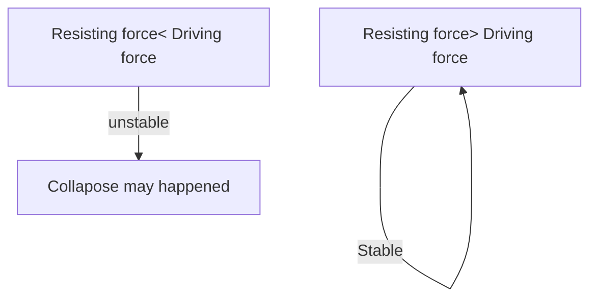
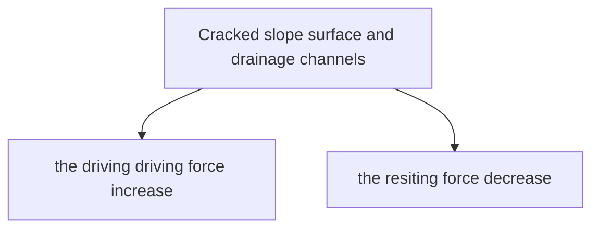

# Landslide
Landslide are ==the collapse of slopes==.Occur when a ==mass of soils and rock of all sizes move down a sloe rapidly== due to gravity 
The Landslide happened in ==natural terrain== and ==man-made slopes==.

# Effect of landslides
- ==Cause injuries and even deaths==
- ==Bury building and damage infrastructure(基礎設施)==
- ==Block roads and stop traffic==
# Reason of Landslides

> [!NOTE] Driving force
>  ==Drive movements==
>  ==Pulls slope materials downhill under the force of gravity==
>  Factors: ==Slope gradient and weight of slope materials==

> [!NOTE] Resisting force
> ==Prevents slope materials from sliding down==
> Factors:==cohesion of slope materials==
> Factors:==force of friction==
	

# Cause of landslides in HK
## Natural factors
### Heavy rainfall
During summer, large amount of rainwater ==adds much weight to the slope==
The ==weight of slope materials increase== , ==the driving force increased==
### Strong weathering
Weathering(風化) ==wearing away or breakdown of rocks on the earth's surface==
Hard rocks become ==weak and can be broken easily==
Granite in HK often ==deeply weathered== , The ==resisting force of it decrease==
### Large slope gradient

==The larger the slope gradient== , the stronger the ==force pulling slope materials downhill==

## human factors 

### Human activities on slopes
Many slope cut and filled to build, this increase the [[U3 Landslide#^Large slope gradient]]
Nowadays , with ==stricter laws and better slope management==
## Poor maintenance of man-made slopes
Man-made slope will ==break== after some time if there is ==no proper maintenance==

# Preventive measure
## Building barriers
To prevent slope material rushing down, barrier can built at ==the bottom of the slope==. ==Reduce the loss of life and property==

## Strengthening and monitoring slopes

==Reduce the risk of landslides== on Man-made slope by ==strengthening==these slope

- Build retaining wall to ==support== a steep slope
- Installing soil nails to ==anchor the soil== to the slope
- Building a gabion wall to ==provide support== at the foot of slope
- Covering slope with shotcrete to ==prevent water from seeping== into slope
- Installing weepholes to ==drain water== Requiring property owners to carry out pro
- Installing drainage channels to ==drain water==
## setting up laws
Set up law to ==restrict development on steep slopes==
Requiring property owners to carry out ==proper slope maintenance measures==
## Setting up warning systems
The HKO will issue ==landslip warning==

## Education 
Government educated the public about ==the appropriate cation to take== when landslip warning

- Avoid ==walking or standing close to steep slope==
- Stay at ==home or in a safe place==

# Remedial measures
- Well-trained ==rescue team and emergency aid== 
- ==Temporary shelters== provided 
- Financial aid and insurance compensation provided to ==rebuild peoples's homes==
