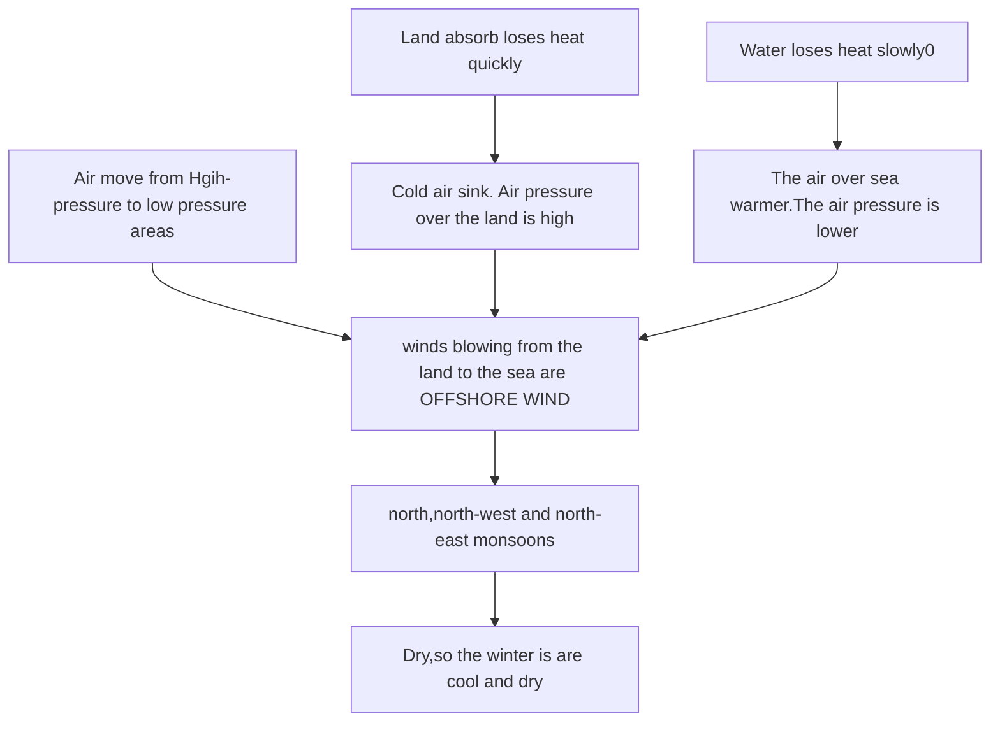
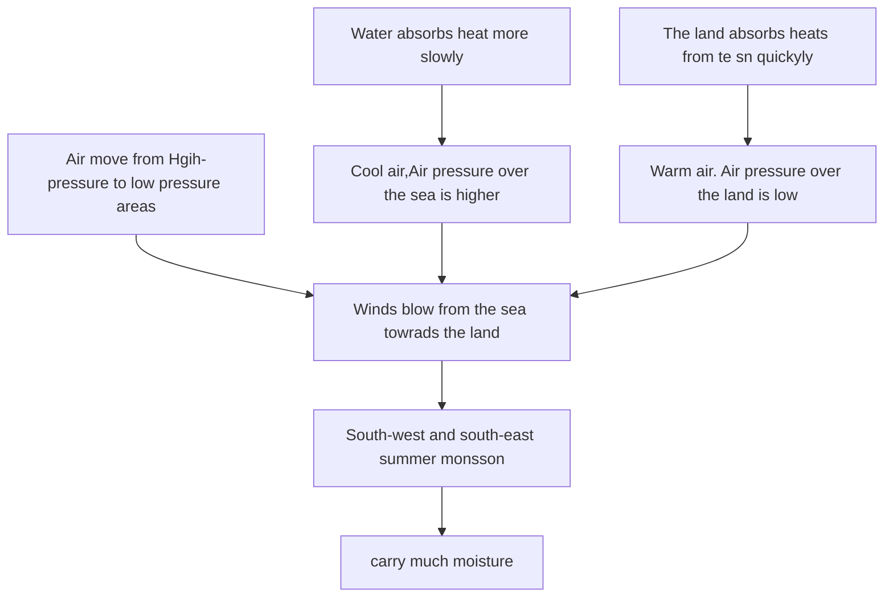

# Weather and Climate

Weather is the ==air condition of the air over short period of time== 
Climate is the ==average weather conditions over many years==

## Elements

- ==Air temperature== (℃ or ℉)
- ==Wind direction== (N,E,S,W)
- ==Wind speed== (m/s)
- ==Air pressure==(hPa)
- ==Precipitation==(mm)
- ==Relative humidity==(%)
- ==Sunshine duration==(hour)

# Climate characteristics of ==South China==

Season in South China are ==Distinctive== 

## Climate characteristics of Hong Kong 

| Spring | Mild         | Humid           |
| ------ | ------------ | --------------- |
| Summer | Hot and wet  | southerly winds |
| Autumn | Warm and dry | Fine and sunny  |
| Winter | Cool and dry |                 |

## Monsoons
Monsoons are ==winds that change directions seasonally==
South China has ==monsoon climate==
### Wet monsoon
In ==cool and dry winters==

### Summer Monsoons

