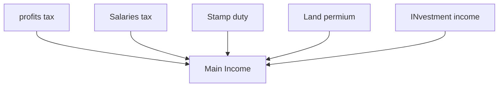

# Public finance 
==The government revenue and expenditure==

# Article 106
HKSAR shall have ==independent finance== 
# Article 107
The HKSAR shall follow the principle of ==keeping the expenditure within the limits of revenues in drawing up its budget== .... to achieve a ==fiscal balance , avoid deficits and keep the budget commensurate with the growth rate of its GDP.==

# Income

# Major expenditure
- ==Housing== 
- ==Security==
- ==Economic==
- ==Education==
- ==Health==
## function
- Provide Various type of ==public services and good==  to meet social needs 
- ==Redistribute income== to narrow the income gap
- ==Promote economic growth==
-

[[mod 13 GDP]]