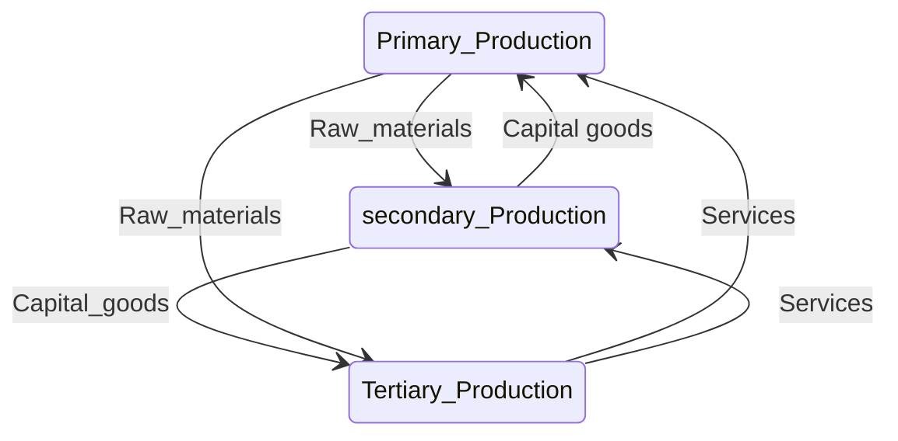

# type of production

# Factor of production
- ==Land==
- ==Capital==
- ==Labour==
- ==Entrepreneurship==

# Labour mobility
- ==Retraining programmes==
- ==Required skills==
- ==Entry barriers==
- ==Availability of information==

# Labour supply
- ==Size of labour force==
- ==The percentage of working population==
- ==Working hours of workers==
- ==Unemployment benefits==

# Average productivity
$$
 = (total+output)/(total+number+of+man+hours)
$$
# Division of Labour
SPECIALIZATION

# [[payment method]]

## employee
### advantage 
#### Time rate
: Stable income
#### Piece rate
: Possibility of getting higher income
### disadvantage
#### Piece rate
: Unstable income
#### Profit sharing
: Unstable 
## employer
### advantage 
#### Time rate
: Lower cost of measuring the wage payment
#### Piece rate
: Lower cost of monitoring employees
#### Profit sharing
: Lower cost of monitoring employees
### disadvantage
#### Time rate 
: Higher cost of monitoring employees
#### Piece rate
: Higher cost of measuring wage payment

# Labour Productivity

[[mod 15 China Eco]]
