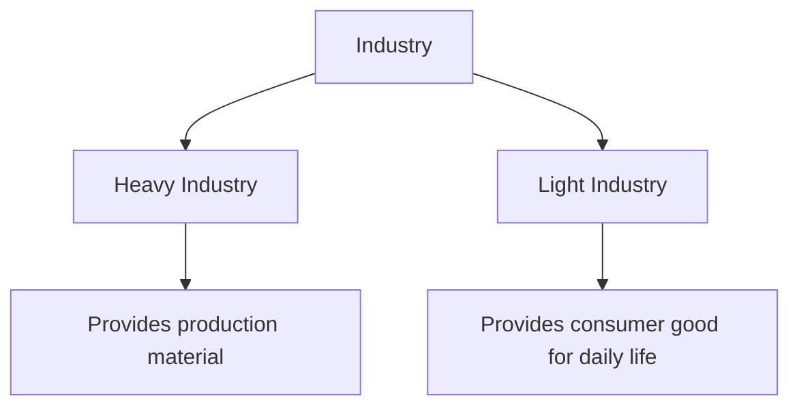

# GDP per capita
$$
=GDP/(Population+size)
$$
# Industry

```mermaid
	flowchart TD

    A[Industry] --> B[Heavy Industry]

    B[Heavy Industry] --> D[Provides production material]

    A[Industry] --> C[Light Industry]

    C[Light Industry] --> E[Provides consumer good for daily life]
```

[[mod 14 Labour market#^type of production]]
[[type of production#type of production]]

[[mod 16 Role of Chinese Government]]
