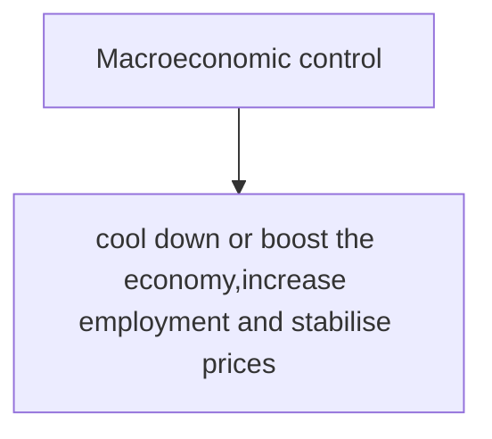
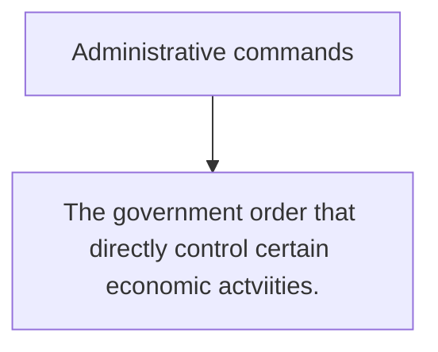
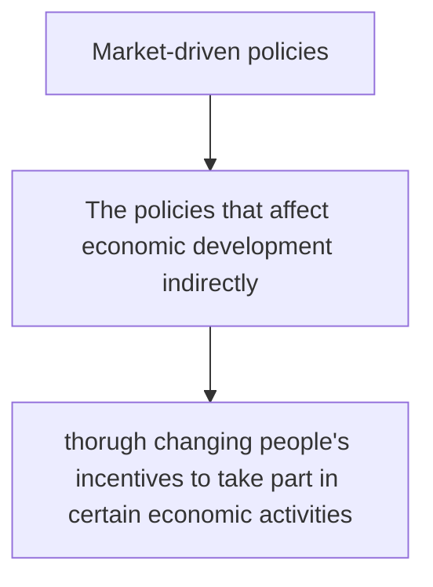

# **==14th==** five year plan
This refers to the ==long-range objectives through the year 2025==
# Macroeconomic control
## Macroeconomic control

## Administrative commands

## Market-driven policies

# socialist markets 
> China adopted a panned economy in 1949
> In late 1970s, turned into **socialist market economy**
## feature
- ==State-controlled== and private enterprises drive economic growth together
- ==Income is distributed based on effort==. ==Taxes and social security systems== are used to avoid a widening income gap
- The government uses more indirect means to ==regulate economic growth==.
-
[[mod 17 Industrial shift]]
