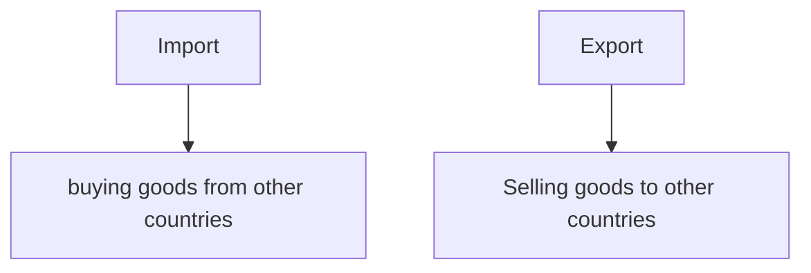
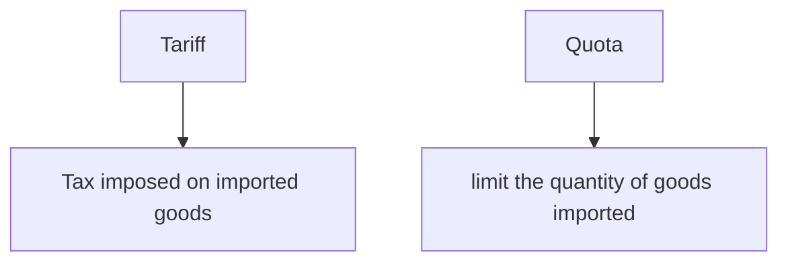
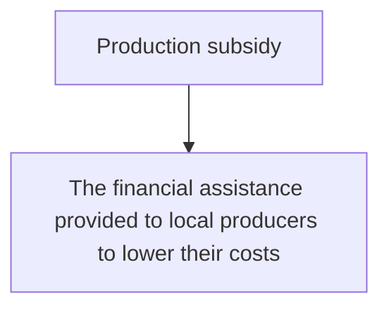

# World Trade

## ==Benefits==
- ==Save production costs==
- ==Raise production efficiency==
- ==Enjoy goods that cannot be produced by itself==
- ==Provide more choices==
>==Less competitive industries== in the country will diminish with ==massive job losses==.
>Moreover,its ==infant industries== are usually less competitive

# Trade protection measures
- ==Tariff==
- ==Quota==
- ==Production subsidy==

## Winner and Loser 

|       ==Consumers== |  ==Loser== |
| --------------: | -----: |
|       ==Importers== |  ==Loser== |
| ==Local producers== | ==Winner== |
|   ==Local Workers== | ==Winner== |
> Many country using ==different forms of trade protection measures to limit trade==

>==The US trade deficit against China== in recent years

# External Trade
- ==Visible Trade==
- ==Invisible Trade==
- ==Domestic Exports==
- ==RE-Exports==
- ==Fair Trade==
# ***==CHINA-US TRADE WAR==***
The ==confrontation between China and the US== over trade disputes in ==protecting economic interests==.
And ==both countries have imposed additional tariffs on a variety of imported goods.==
This ==reduce foreign trade and production costs.==Affect the country's ==industrial output, employment opportunities and economic growth in the long run.==

## Effect 
China's imposition of tariffs on US soya beans has resulted in a rise in domestic prices , ==affecting peoples quality of life== and ==soya beans price dropped==, ==increase domestic costs and reduce foreign investment.== ==Affecting country industrial's output== 
*==**To mitigate the threat from international , New development paradigm with domestic circulation being the mainstay and domestic and international circulation reinforcing each other.***==
![[WhatsApp Image 2024-06-04 at 21.35.19_e9c034d3.jpg]]
![[WhatsApp Image 2024-06-04 at 21.35.19_adc017eb.jpg]]

[[mod 20 Economic globalization]]
