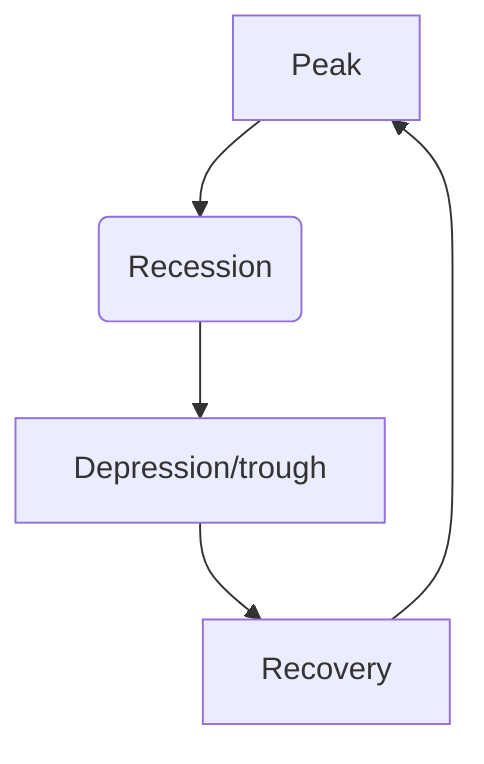

>Goods and factors of production such as capital labour, information and technology flow freely across borders around the around world

# Multinational corporations 
- Enterprise that ==operate in two or more countries.== They make use of (==regional division of labour==)
- ==regional labour of labour==: A ==country or region specialises== in producing a certain good or providing certain services
- ==Financial tsunami==: The ==economic crisis== triggered by the burst of ==the US property bubble in 2007==, which has led to ==recession or slowdown in the economies worldwide==

# Business Cycle
>==business cycle, aka the economic cycle== or trade cycle , is the ==downward and upward movement of GDP== around its ==long-term growth== trend.
1. Peak 
2. Recession
3. Depression/Trough
4. Recovery

|            | growth rate of ==real output== | Unemployment rate | inflation rate | consumption level |
| ---------- | ------------------------------ | ----------------- | -------------- | ----------------- |
| Peak       |                                |                   |                |                   |
| Recession  | Falling                        | Rising            |                |                   |
| Depression |                                |                   |                |                   |
| Recovery   | Rising                         | Falling           | to rise        |                   |

